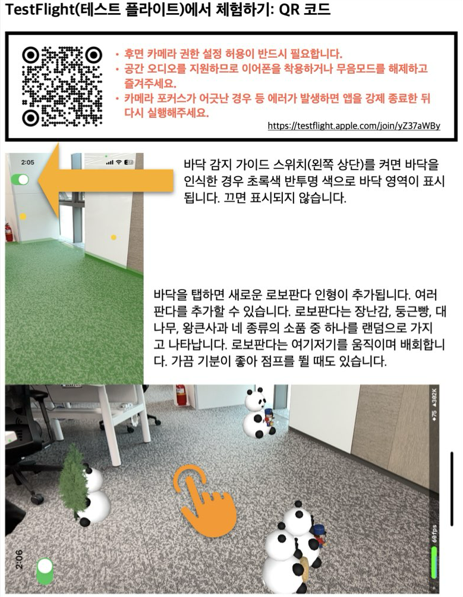
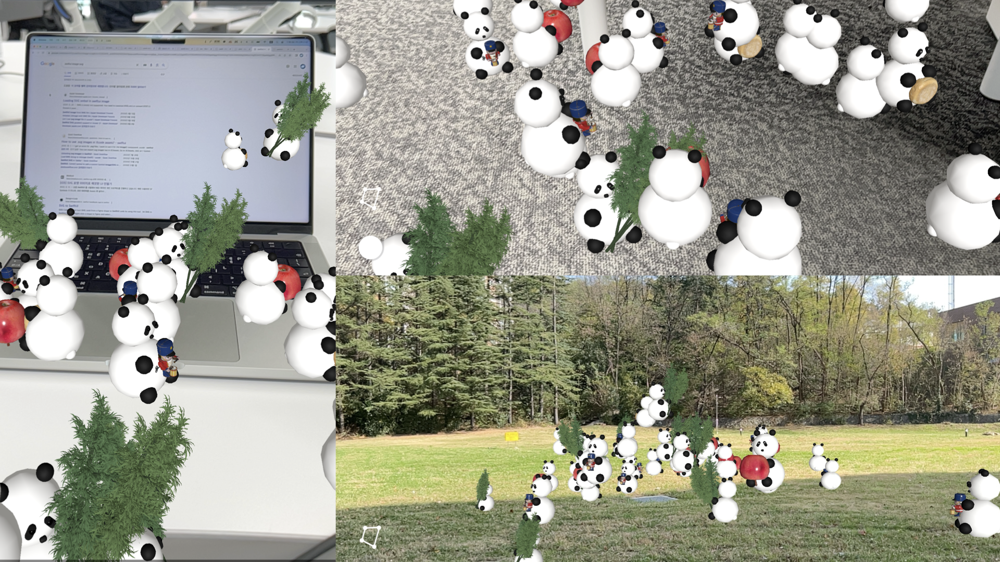

# RoboPanda
- 바닥 인식 기능을 이용해 로봇처럼 움직이는 판다 인형을 AR 공간에 배치할 수 있습니다.
- SceneKit과 바닥 인식 기술 및 Reality Composer Pro를 이용한 AR(Augmented Reality) 앱입니다.
- `Apple Developer Academy @ POSTECH 2기 AR 전시회`에서 전시된 출품작입니다.

## TestFlight에서 체험해보기
- 아이폰/아이패드에 TestFlight 앱을 설치한 뒤 아래 링크를 클릭해 앱을 설치합니다.
- https://testflight.apple.com/join/yZ37aWBy

## 매뉴얼

## 스크린샷

